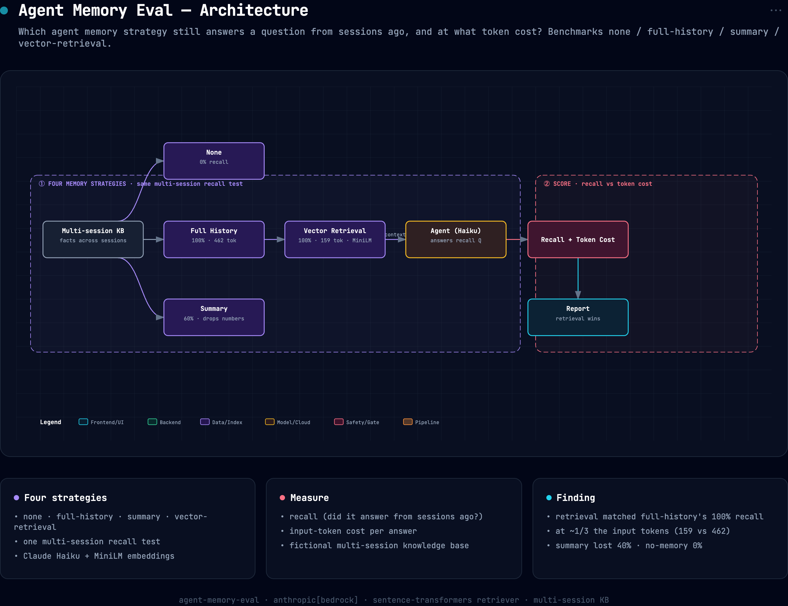

# agent-memory-eval

**An agent that talks to a user across many sessions accumulates more history than fits in one
context window. Which memory strategy still lets it answer a question about something said sessions
ago, and at what token cost?** This benchmarks four strategies on a multi-session recall test with
planted facts.

```bash
pip install -e ".[dev,real]"
agent-memory-eval                    # real Claude on Bedrock + MiniLM retriever
agent-memory-eval --k 4 --json results.json
agent-memory-eval --offline          # fake agent + hashing retriever, no keys
pytest -q                            # offline tests — no keys, no network
```


## Architecture



*Interactive/exportable version: [`docs/assets/architecture.html`](docs/assets/architecture.html).*

## The strategies

The history is 8 short "sessions" of mostly chatter, with specific facts planted in particular
sessions (a codename, a region, a rotation interval, a manager's name, a retention period, an accent
color…). Ten recall questions each target one planted fact. The four ways the agent can bring memory
to bear:

- **none**, only the question. The floor: it can't know anything session-specific.
- **full**, the entire history in the prompt. Recall ceiling, but input tokens grow with the whole
  conversation forever (and eventually overflow the window).
- **summary**, the history compressed once into an LLM summary, used as the context. Cheap and flat,
  but summarization drops specifics it judged unimportant.
- **retrieval**, the history chunked per turn, embedded, and only the turns most relevant to the
  question put in the prompt. Cheap and flat like summary, but it can surface the *exact* turn.

## Results (real run: Claude Haiku 4.5 on Bedrock, MiniLM retriever, 10 recall questions)

| strategy | recall accuracy | mean input tokens | one-time setup tokens |
|---|---:|---:|---:|
| none | 0.000 | 72 | 0 |
| full | **1.000** | 462 | 0 |
| summary | 0.600 | 207 | 550 |
| retrieval | **1.000** | **159** | 0 |

## Findings

- **Retrieval matched full-history recall, at a third of the tokens.** Retrieving the ~4 most
  relevant turns answered **100%** of the recall questions on **159 input tokens**, versus stuffing the
  whole history for the same 100% on **462 tokens (2.9×)**. For factual recall, fetching the exact
  relevant turn is as good as reading everything and far cheaper, and unlike "full," it doesn't grow
  with the conversation.
- **Summarizing memory lost 40% of the facts.** The summary strategy answered only **60%**, it kept
  the headline facts (the codename, the manager, the framework) but dropped the *specifics*: the exact
  region (`us-west-2`), the token rotation interval (30 minutes), the log-retention period (400 days),
  the accent color. Compression sheds precisely the concrete details you most often need to recall
  later, and it isn't even free, building the summary cost a one-time 550 tokens on top.
- **No memory is a hard zero.** With only the question, the agent got **0/10**, confirming the task
  genuinely requires memory and isn't answerable from priors.
- **The ranking is retrieval > full > summary once cost is in view.** Retrieval wins on
  accuracy-per-token; full ties on accuracy but scales badly and will overflow the window at real
  conversation length (the reason memory strategies exist at all); summary is the trap, cheapest
  per-query context but it silently drops the facts, so it *looks* efficient while quietly failing 40%
  of recalls.

> ⚠️ Scope: 10 recall questions over 8 sessions, one embedder (MiniLM), one summarizer prompt. `full`
> scores 100% only because the whole history still fits one context here; at real multi-session scale
> it would exceed the window entirely, which is the entire motivation for retrieval and summary. The
> numbers are directional; the mechanism (retrieval ≈ full at a fraction of the cost, summary drops
> specifics) is the reproducible result and matches known agent-memory findings.

## How it works

```
src/memeval/
  data.py        multi-session history with planted facts + recall questions (short checkable answers)
  llm.py         Claude client (Bedrock default / direct Anthropic) + a context-only offline fake agent
  embed.py       per-turn retriever (MiniLM by default, hashing embedder offline)
  benchmark.py   run all 4 strategies → recall accuracy + mean input tokens (+ summary setup cost)
  cli.py         run real (Bedrock/Anthropic) or --offline, optional --json
```

Scoring is substring match against the planted fact (each answer is a name, number, or short phrase),
and the agent is told to answer only from its notes and say "I don't know" otherwise, so a
hallucinated answer scores 0. The offline path uses a fake agent that answers only from the context it
was handed (modeling the real dynamic) and a deliberately-lossy fake summary, so CI verifies the
strategy mechanics with no keys.

## License

MIT
